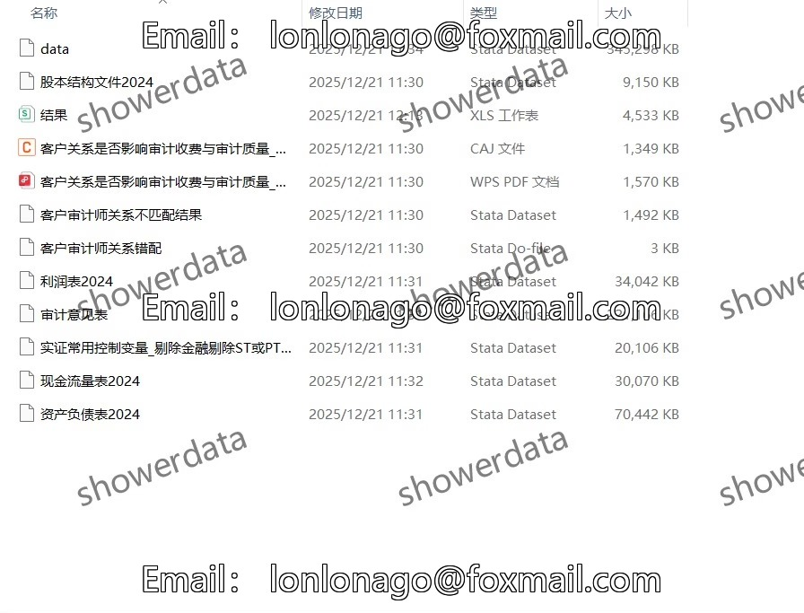
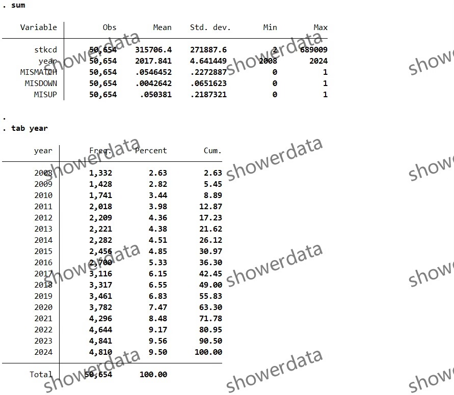
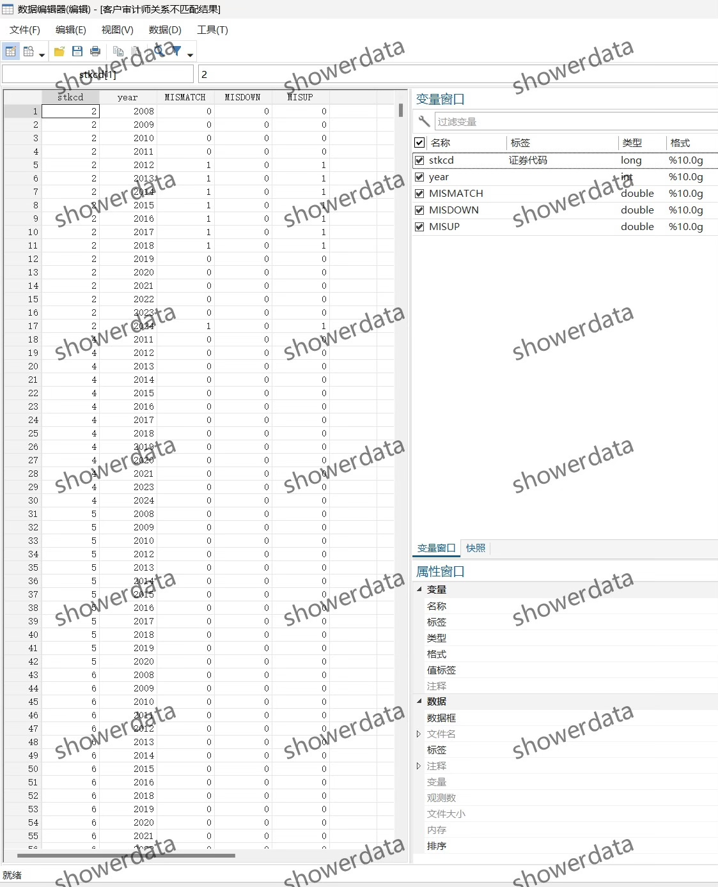
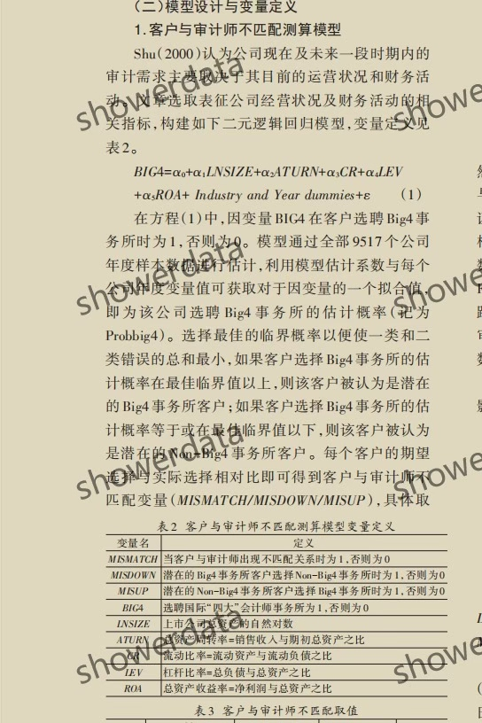

## Body

（2008-2024年）Public Listed Companies - Mismatch in Customer Auditor Relationship

I. Data Introduction
(1) Details of the data: See the image below for a complete display, please confirm before purchasing! The description is fully detailed, please make sure it's what you need before placing your order! No returns or exchanges will be accepted for any reason after shipment.
(2) Name of the data: Public Listed Companies - Mismatch in Customer Auditor Relationship
(3) Sample range: A Gu Shang Company, over 50,000 observation values (trimmed and excluded as needed; if not, rerun the code).
(4) Time range: 2008-2024
(5) Data format: dta, excel
(6) Data content: Results, references, codes, raw data
(7) Source of raw data: CS.MAR

II. Data Results Indicators as Shown in the Figure
Big4 does not have data on the ranking of firms by 2024, so the ranking data for 2023 is used instead.

III. Calculation Method as Shown in the Figure

IV. References
[1] Huang Bo, Li Haitong, Jiang Ping, et al. Strategic Alliances, Elemental Flow, and Enterprise Total Factor Productivity Improvement [J]. Management World, 2022, 38(10): 195-212. DOI: 10.19744/j.cnki.11-1235/f.2022.0146.

## Images

item_1005550669123

Here is a pay link on Stripe ( https://buy.stripe.com/3cs8yP7sY87d0vu9AB ). Please contact me lonlonago@foxmail.com after funding $89, and I will send you a complete data files , thank you!

